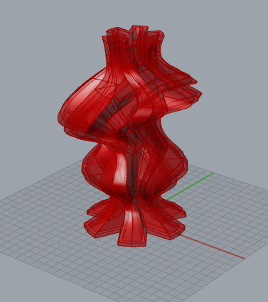
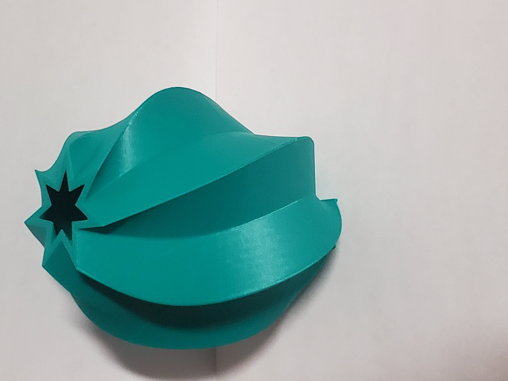
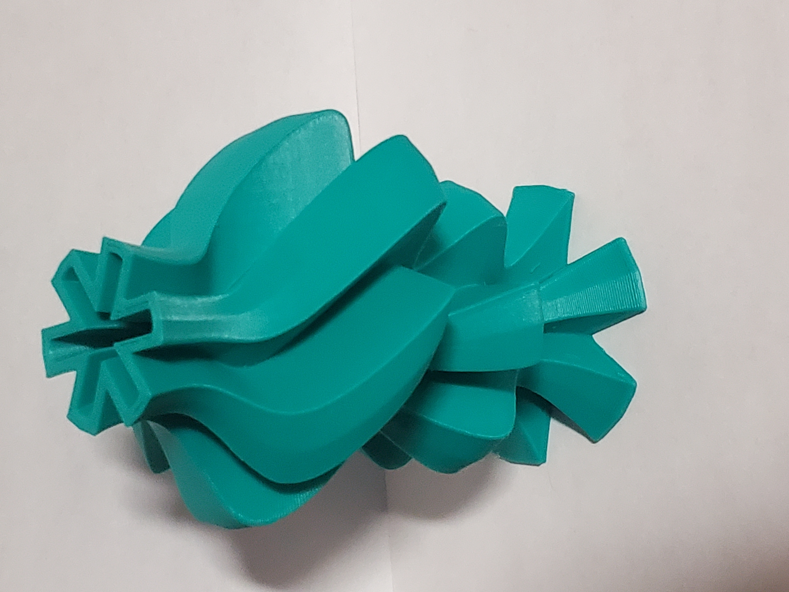
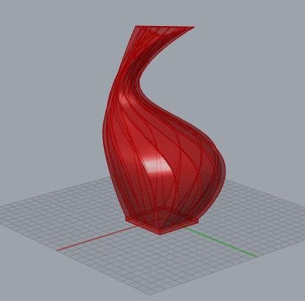
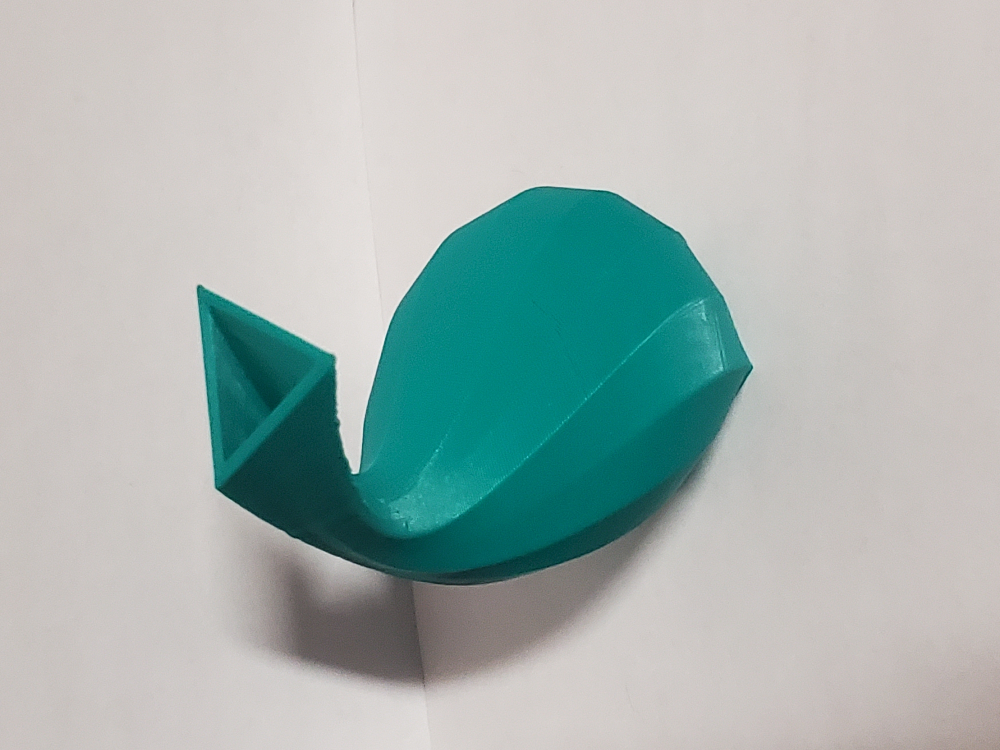
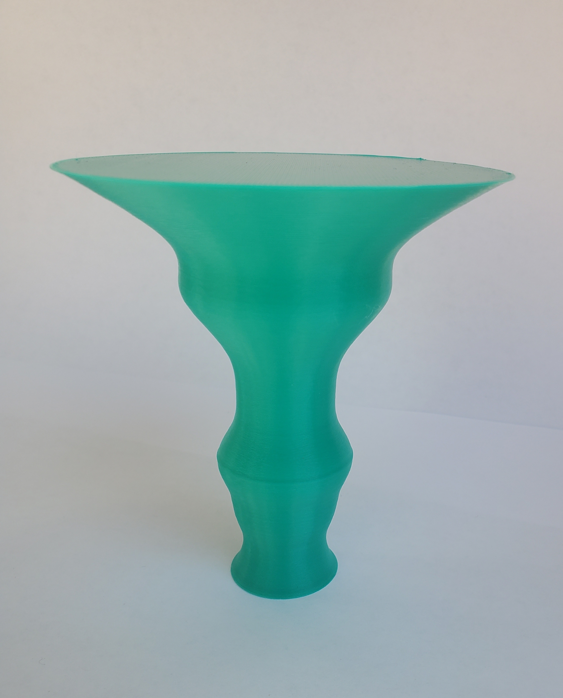
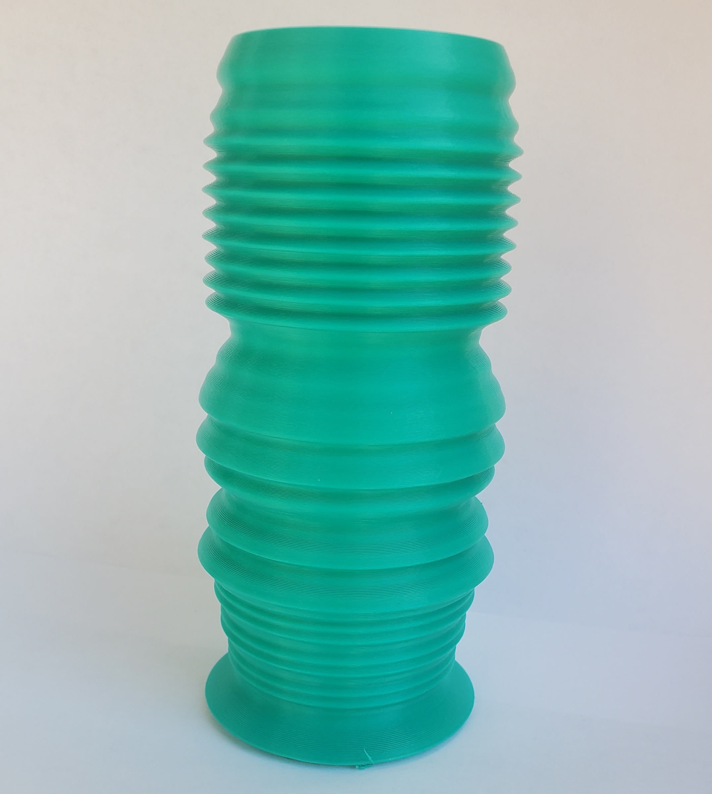
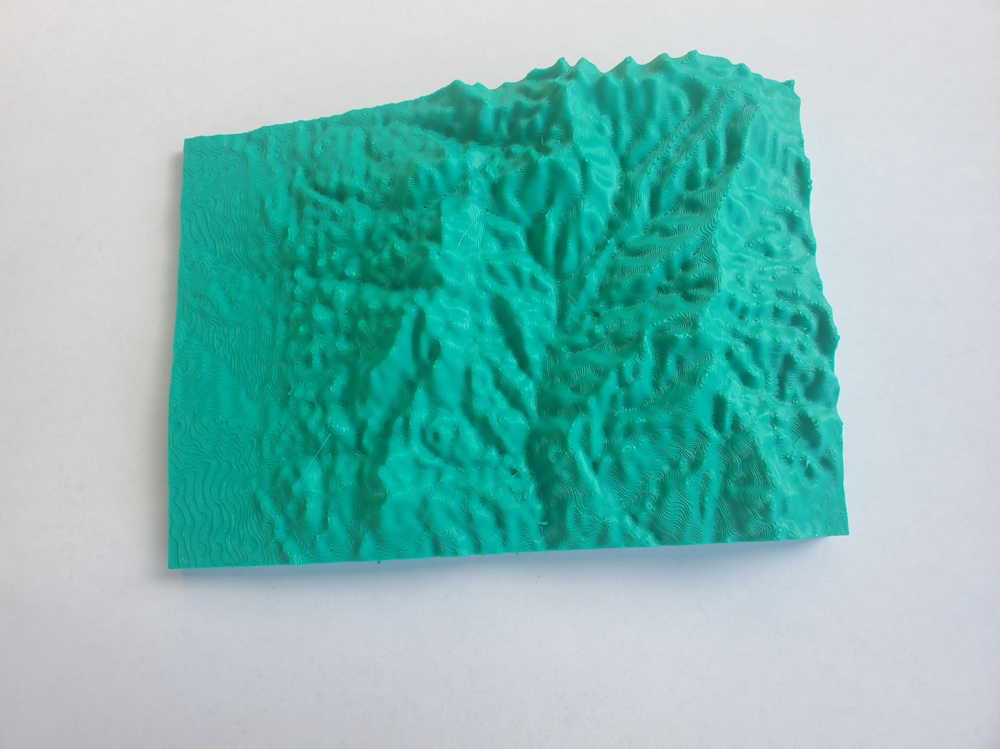
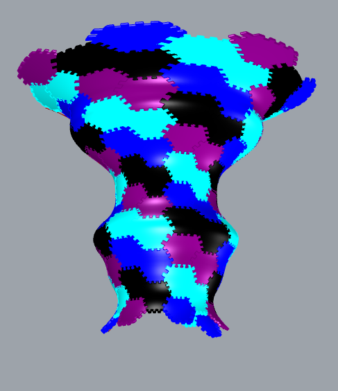

# CS_491_Comp_Fabrication
 This repository is a showcase of projects completed in a computational fabrication course.
 

## Project 1: L-Systems

The project was to create plantlike structures by feeding sets of rules, in the form of 
letters that are given meaning through the program written. I created 3 different 
structures from plants I found in New Mexico. The systems are created in Processing 
using Java and a custom Turtle library. Every time the program is run the system created 
will be slightly different due to some randomization in the code. Below are examples of 
plant inspiration and the resulting L-System. Code or grasshopper files and Higher 
resolution images are in the files.

### Desert Bird of Paradise:

    <figure>
        
        <figcaption>Actual plant</figcaption>
    </figure>
    <figure>
    
    <figcaption>L-System</figcaption>
    </figure>

### Broom Snakeweed:

    <figure>
    
    <figcaption>Part of the bush</figcaption>
    </figure>
    <figure>
    
    <figcaption>L-System</figcaption>
    </figure>

### Tree:

    <figure>
    
    <figcaption>Tree souce image</figcaption>
    </figure>
    <figure>
    
    <figcaption>L-System</figcaption>
    </figure>

## Parametric Vessels

The second project was creating a program to create vase like objects with variable 
attribues such as number of layers of polygons, number of sides on each layer and the 
angle of each layer etc. The program was created in grasshopper Rhino using python code.

    <figure>
        
        <figcaption>Rhino Preview Cog</figcaption>
    </figure>
    <figure>
        
        <figcaption>Vessel Printing</figcaption>
    </figure>

    <figure>
        
        <figcaption>Star Vessel</figcaption>
    </figure>
    <figure>
        
        <figcaption>Cog Vessel</figcaption>
    </figure>

    <figure>
        
        <figcaption>Rhino Goose Neck Preview</figcaption>
    </figure>
    <figure>
        
        <figcaption>Goose Neck Vessel</figcaption>
    </figure>

## Data Physicalization

This project was to take sets of data and use it to create physical objects. The first 
was visualization of Northern Flicker sightings from Audobon's christmas bird count. 
I think this data is a bit skewed by more people reporting data in more recent years 
leading to misleading visuals. The second data set I wanted to visualize a piece of music,
I chose Bach's violin partita no.3. I was able to find a MIDI file of the piece and wrote a python script for reading the midi file and getting the average value(0-127) of groups of 4 notes. I selected 100 data points from these averages and created a vessel. The final object was a topography of a mountain range in Santa Fe, New Mexico. I found a bitmap of the area and used the brightness of the pixels to create the height for certain points on the object.

    <figure>
        
        <figcaption>Flicker Data Vessel</figcaption>
    </figure>
    <figure>
        
        <figcaption>Bach partita Vessel</figcaption>
    </figure>

    <figure>
        
        <figcaption>Rhino Preview of Topography</figcaption>
    </figure>
    <figure>
        
        <figcaption>Santa Fe Ski Area Topography</figcaption>
    </figure>

## Tiling

This project was to delve in to tiling of a plane and of objects. I created a hexagonal 
tiling in grasshopper also created 3D game piece like objects that also create a tiling. 
The hexagonal tilings can be modified using a line created in Rhino to make more interesing
"escher" like tilings.

    <figure>
        
        <figcaption>Hexagonal Tiling of a Plane</figcaption>
    </figure>
    <figure>
        
        <figcaption>Escher Like Tiling of a Plane</figcaption>
    </figure>

    <figure>
        
        <figcaption>Tiling a Surface</figcaption>
    </figure>
    <figure>
        
        <figcaption>Rhino Preview of 3d Tile</figcaption>
    </figure>

    <figure>
        
        <figcaption>3D Hexagonal Tiles</figcaption>
    </figure>

## Variable Ukulele 

The final project was one of our own choosing, implementing one or more of the techniques
we learned throughout the course. I chose to create an instrument with an adjustable body
shape. I used the tiling technique in the creation of the instrument body creating a line
in Rhino and using that to make a "tile" of the sides of the body leading to some 
interesting looking instruments. Some 3-D modeling came into play for the neck of the
ukulele. The instrument was playable but a better gluing method was needed as the neck 
broke off due to the stress of the strings after a while.

    <figure>
        
        <figcaption>Jaged body shape Rhino preview</figcaption>
    </figure>
    <figure>
        
        <figcaption>Spiky wavy body Rhino preveiew</figcaption>
    </figure>

    <figure>
        
        <figcaption>Printed body</figcaption>
    </figure>
    <figure>
        
        <figcaption>another printed body</figcaption>
    </figure>

    <figure>
        
        <figcaption>Printed body</figcaption>
    </figure>

